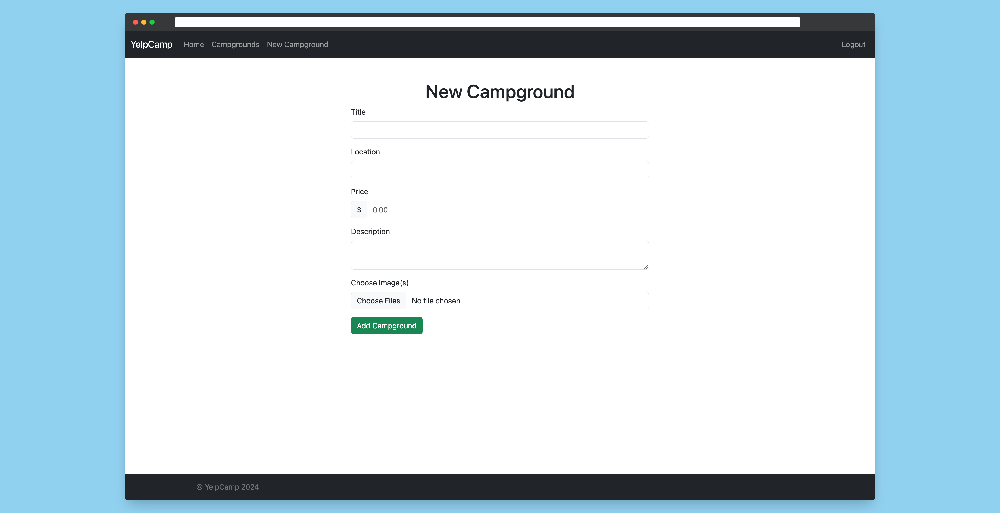

# Yelp Camp

## Overview

Yelp Camp is a full-stack website project that allows users to explore, create, and review campgrounds. It provides a platform for users to discover new camping destinations, share their experiences, and connect with fellow outdoor enthusiasts. You can visit the website [https://yelp-camp-tkfu.onrender.com](https://yelp-camp-tkfu.onrender.com/).

## Screenshots

### Homepage


### All Campgrounds Page


### Show Page


### New Campground Page


### Edit Campground


### Login & Register Page


## Technologies Used

### Frontend 


### Backend


### Database


### Authentication


### Template Engine


### Deployment


## Instructions

To run the Yelp Camp project locally, follow these steps:

1. Clone the repository to your local machine:
```bash
git clone https://github.com/akdevv/yelp-camp.git
```

2. Navigate to the project directory:
```bash
cd yelp-camp
```

3. Install dependencies using npm:
```bash
npm install
```

4. Set up the environment variables:
    - Create your account on [MongoDB](https://www.mongodb.com/) and get DB url
    - Create you account on [Mapbox](https://cloudinary.com/) and get Access Token
    - Create your account on [Cloudinary](https://cloudinary.com/) and get API keys
    - Create a `.env` file in the root directory
    - And add the following environment variables:
    ```js
        CLOUDINARY_CLOUD_NAME=<<your-cloud-name>>
        CLOUDINARY_API_KEY=<<your-api-key>>
        CLOUDINARY_API_SECRET=<<your-api-secret>>
        MAPBOX_TOKEN=<<your-mapbox-token>>
        DB_URL=<<your-mongodb-url>>
        SECRET=<<secret-pharase>>
    ```

5. Run the project:
```bash
npm start
```

6. Access the application through your web browser at `http://localhost:3000`.

## File Structure

```
├── cloudinary/                 # cloudinary config script
├── controllers/                # backend controllers (express)
├── models/                     # backend models (mongoose)
├── public                      # static assets
│   ├── images/
│   ├── javascripts/
│   └── stylesheets/
├── routes/                     # backend route handlers
├── seeds/                      # database seeding scripts
├── utils/                      # utility functions
├── views/                      # server-side rendered views (EJS)
│   ├── campgrounds             # campground views
│   │   ├── edit.ejs
│   │   ├── index.ejs
│   │   ├── new.ejs
│   │   └── show.ejs
│   ├── layouts                 # boilerplate layout
│   │   └── boilerplate.ejs
│   ├── partials                # EJS partials (flash msg, footer & navbar)
│   │   ├── flash.ejs
│   │   ├── footer.ejs
│   │   └── navbar.ejs
│   ├── users                   # users views
│   │   ├── login.ejs
│   │   └── register.ejs
│   ├── error.ejs
│   └── home.ejs
├── app.js                      # main script file
├── middleware.js               # custom middleware functions
├── schemas.js                  # joi validation schemas
├── .gitignore
├── package-lock.json
├── package.json
└── README.md
```

## Credits

This project was created with reference to the Udemy course [The Web Developer Bootcamp](https://www.udemy.com/course/the-web-developer-bootcamp/) by **Colt Steele**. I appreciate the valuable insights and knowledge gained from the course.
